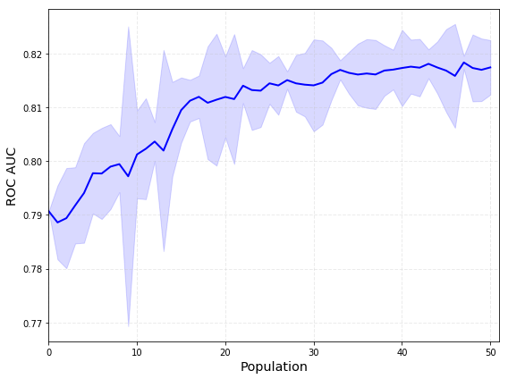
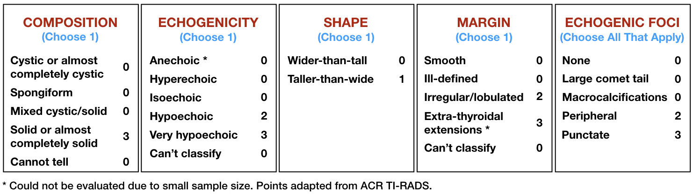

# AI-TI-RADS

## Docker

```
docker build -t tirads .
```

```
docker run --rm -p 8889:8889 -v `pwd`:/workspace tirads
```

## Genetic Algorithm Optimization

Optimization code is in the `ai-tirads.ipynb` notebook.

Build and run docker image to open jupyter home page and access the notebook on your local machine.

## Optimization Results

The plot below shows the mean and standard deviation of training loss function (ROC AUC) for each population.



The first population is initialized with individuals representing ACR TI-RADS which achieved 0.79 ROC AUC.

## AI TI-RADS Points



